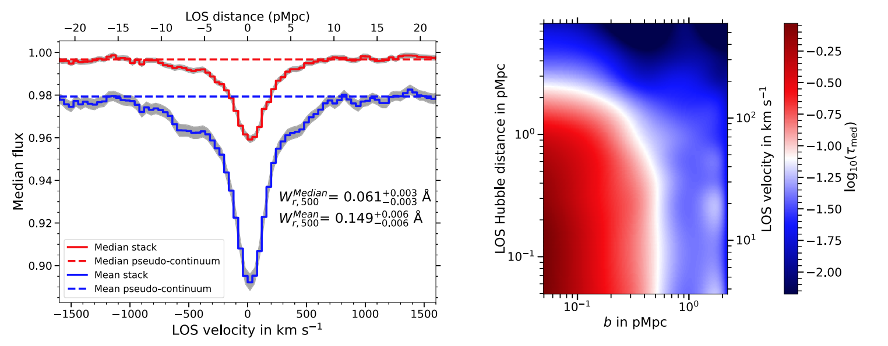
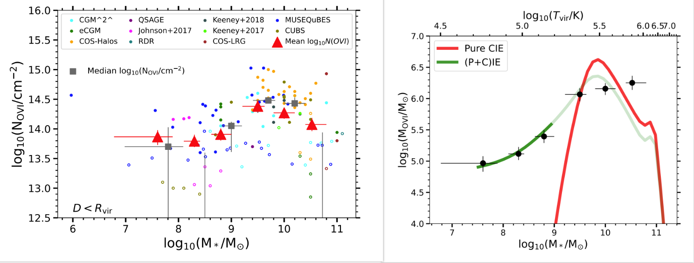

My work is primarily focused on probing the gaseous halo around galaxies by the means of absorption spectroscopy of the background quasars. The galaxies are primarily part of our own <b>MUSEQuBES</b> galaxy survey (<b>MUSE</b> <b>Q</b>uasar-field <b>B</b>lind <b>E</b>mitter <b>S</b>urvey) around 16 quasar sightlines with the highest S/N COS spectra available in the Hubble Legacy Archive. 

<body>

    
    <section id="banner" class="major">
        
 

            <header class="major">
                <h4>MUSEQuBES: mapping the distribution of neutral hydrogen around low-redshift galaxies</h4>
            </header>

            

                
{{ page.description1 }}

                <ul class="actions">
                    <li><a href="https://ui.adsabs.harvard.edu/abs/2024MNRAS.528.3745D/abstract" class="button next scrolly">Abstract</a></li>
                </ul>
            

        

    </section>

    <section id="banner1" class="major">
        
 

            <header class="major">
                <h4>MUSEQuBES: The column density, covering fraction, and mass of OVI-bearing gas in and around low-redshift galaxies</h4>
            </header>
            
              
            
            

                
{{ page.description2 }}

                <ul class="actions">
                    <li><a href="https://ui.adsabs.harvard.edu/abs/2024arXiv240915423D/abstract" class="button next scrolly">Abstract</a></li>
                </ul>
            

        

    </section>

   
     <section id="banner2" class="major">
        
 
          
            
          
            <header class="major">
                <h4>MUSEQuBES: The kinematics of OVI-bearing gas in and around low-redshift galaxies</h4>
            </header>
            

                
{{ page.description3 }}

                <ul class="actions">
                    <li><a href="https://ui.adsabs.harvard.edu/abs/2024arXiv240915432D/abstract" class="button next scrolly">Abstract</a></li>
                </ul>
            

        

    </section>

